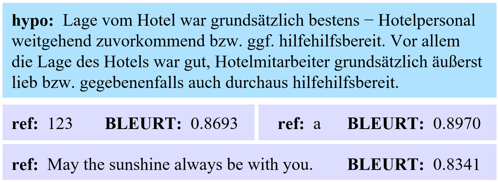
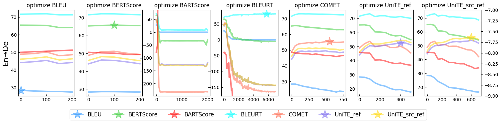

# BLEURT Has Universal Translations: An Analysis of Automatic Metrics by Minimum Risk Training

This repository contains the code for the ACL 2023 paper **BLEURT Has Universal Translations: An Analysis of Automatic Metrics by Minimum Risk Training**.

> **The code is in the process of being organized, I'll get it done as soon as I can.**

## Universal Adversarial Translations
We find universal adversarial translations of BLEURT and BARTScore, which are capable of obtaining high scores when evaluated against any reference sentence.

An example is presented in the figure below:




 > $hypo$ means the translation sentence and $ref$ means the reference sentence. BLEURT needs to compare $hypo$ and $ref$ to judge the quality of $hypo$. This figure shows that the universal translation can achieve high BLEURT scores when calculated with each $ref$, even if $hypo$ and $ref$ are completely unrelated.


## Guide
```
# install fairseq
sudo mkdir /usr/lib/python3.7/site-packages
sudo pip3 install -i https://pypi.tuna.tsinghua.edu.cn/simple --editable .
```
### MRT Training
**Step1: Maximum Likelihood Estimation (MLE) training phase**

Train with conventional negative log-likelihood (NLL) loss

<!-- 
```
# Take En->De as example
bash mrt_scripts\fairseq_train\fairseq_train_normal_ende.sh
```
-->

**Step 2:  MRT training phase**

Fine-tune the model with each metric, so as to obtain translation models with various metric styles

```
# Take En->De as an example
mkdir -p data-bin checkpoints log
cd data-bin
wget https://huggingface.co/datasets/powerpuffpomelo/fairseq_mrt_dataset/resolve/main/wmt14_en2de_cased.zip
unzip wmt14_en2de_cased.zip
cd ../
wget https://huggingface.co/powerpuffpomelo/fairseq_mrt_metric_model/resolve/main/bleurt.zip
unzip bleurt.zip
cd bleurt ; pip3 install -e . --no-deps ; cd ..
GPU_NUM=`nvidia-smi |grep On|wc -l`
echo start bleurt rpc server with $GPU_NUM gpus ...
python3 rpc_bleurt.py -m bleurt/BLEURT-20 -process ${GPU_NUM} > log/bleurt_rpc.log 2>&1 &
bash mrt_scripts/fairseq_train/mrt_ende_bleurt_beam12.sh
```

### Analyze Training Process
**Step1: Generate Hypothesis Sentences from the Training Process**


**Step2: Calculate the Score of Each Metric**


**Step3: Plot Training Process Figures**
```
# Take En->De as an example, you can run this script to perform the above three steps:
bash mrt_scripts/fairseq_analysis/mrt_analysis_bleurt_en2de.sh
```
then you can get a figure like this:

> The horizontal axis represents the training steps, and the vertical axis is the score of each metric  (except for BARTScore on the right axis, which is a negative number because it calculates the logarithmic probability of translations); metrics other than BARTScore and BLEU are mostly distributed between 0 and 1, and we multiply them uniformly by 100 for ease of observation. The asterisk represents the highest value achieved by the optimized metric.

There may be universal translations if you find a circumstance where only one metric improves while the other declines.
